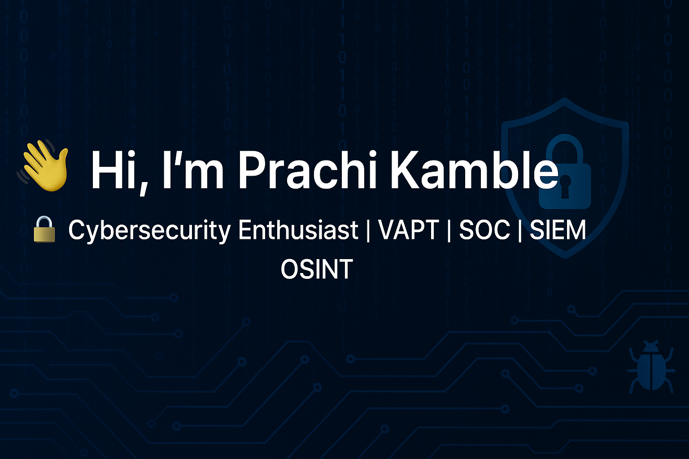

  

<h1 align="center">👋 Hi, I'm Prachi Kamble</h1>
<h3 align="center">🔒 Cybersecurity Enthusiast | VAPT | SOC | SIEM | OSINT</h3>

  

---

### 🧩 About Me
- 🔭 **Hands-on experience:** Vulnerability Assessment & Penetration Testing (VAPT & WAPT) — including real-world targets through VDP programs.  
- 🌱 **Currently learning:** Advanced **WAPT (API & AI Testing)**, **Cloud Security**, and **Digital Forensics**.  
- 🔎 **Exploring:** **OSINT Investigations**, **SOC Monitoring**, and **SIEM tools** (Wazuh) for log analysis and incident detection.  
- 💬 **Ask me about:** Web Application Security, Reconnaissance, and Threat Detection.  
- 📫 **Reach me at:** [prachikamble2345@gmail.com](mailto:prachikamble2345@gmail.com)  
- ⚡ **Fun fact:** I love finding vulnerabilities and reporting them responsibly to make systems safer! 🧐  

---

### 🌐 Connect with Me

  

---

### 🧰 Skills & Tools

  
  
  
  
  
  
  

---

### 📈 GitHub Stats

  
  

---

### 🧠 Quote
> “The quieter you become, the more you are able to hear.” — Kali Linux  
